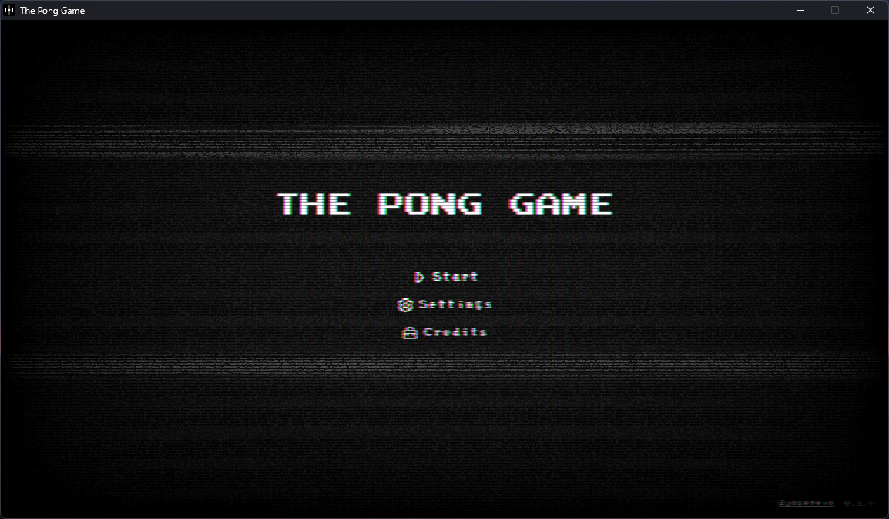
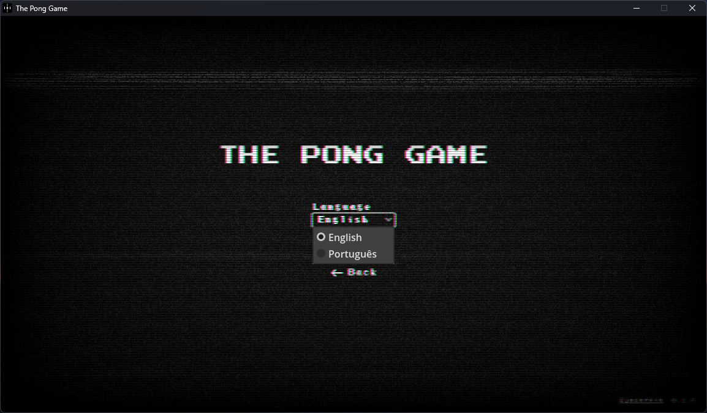
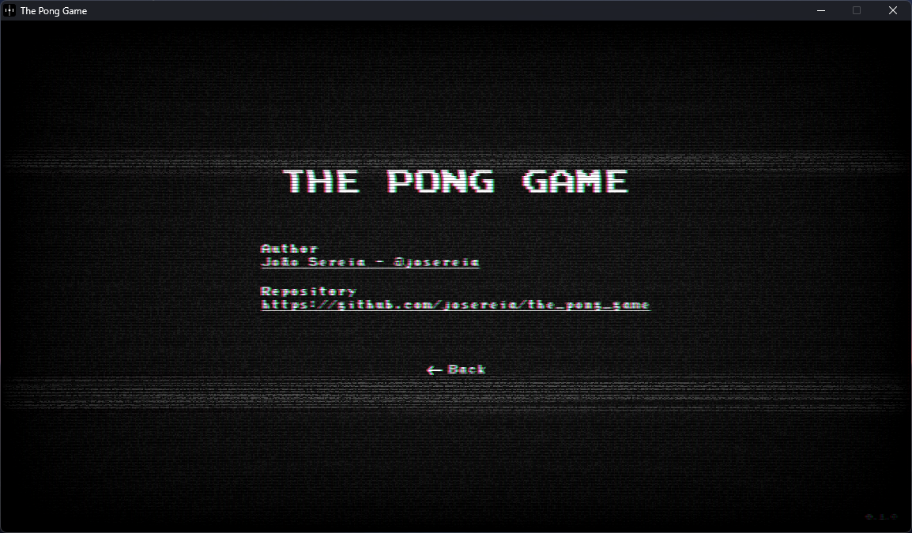
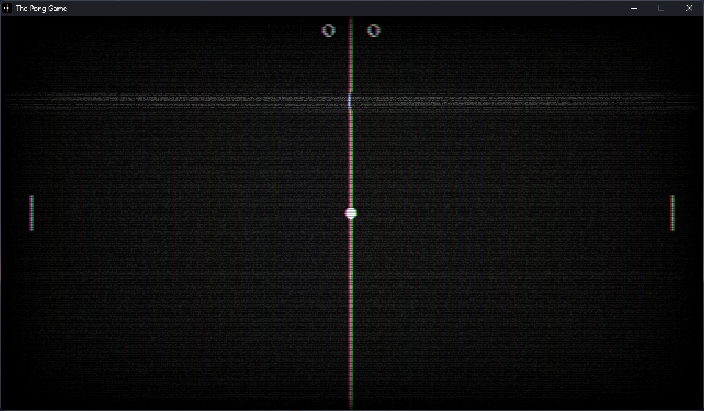

# The Pong Game

A simple and classic game made in the Godot Engine for study purposes.

## Technologies

* Godot Engine
* GDScript

## Platforms

* Windows
* Web

## Features

* Multiplayer(2 players)
* Multilingual(English and Portuguese)

## Screenshots

### Main

### Settings

### Credits

### Game

## Credits

João Sereia <[joao.lo.sereia@gmail.com](mailto:joao.lo.sereia@gmail.com)>
