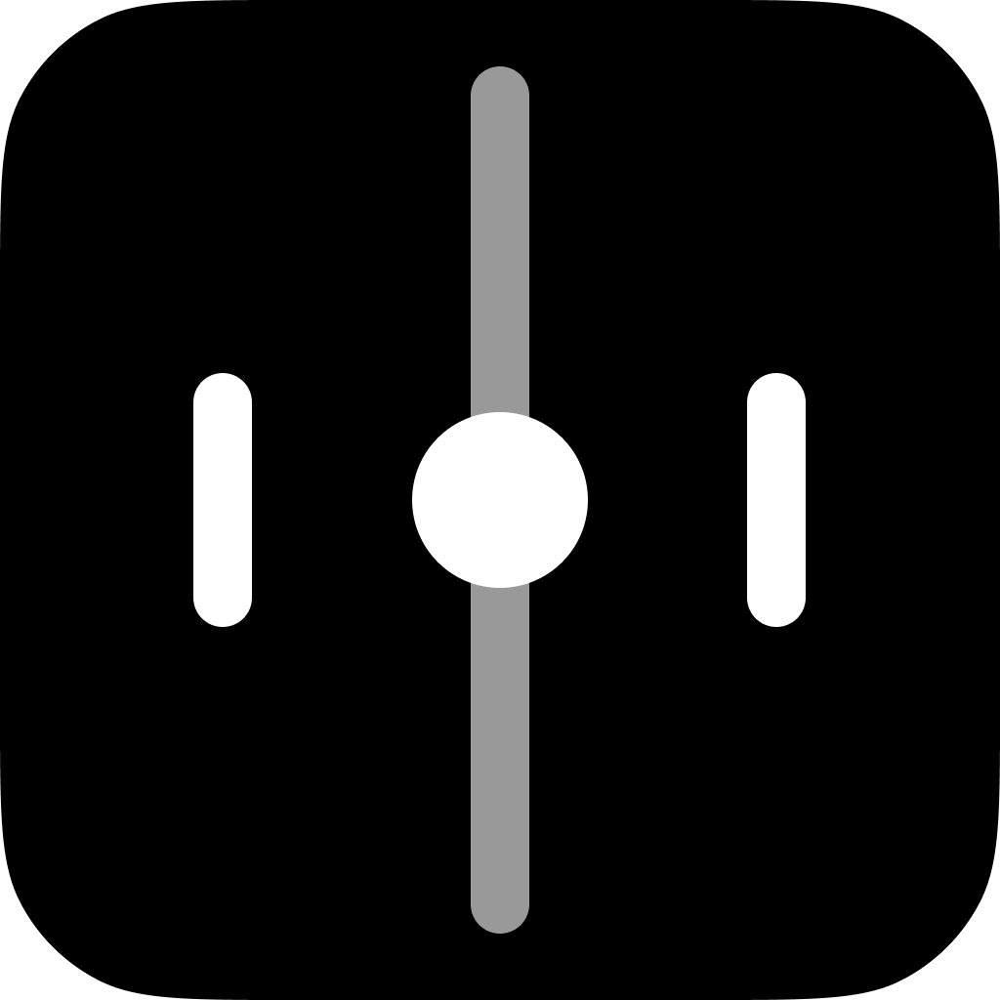

# The Pong Game

The classic Pong game made in the Godot Engine for study purposes.

## Technologies

* GDScript
* Godot Engine

## Platforms

* Web
* Windows

## Features

* Player scores
* VHS/CRT Effect
* Multiplayer(2 players)
* Multilingual(English and Portuguese)

## Screenshots

### Preview

### Main

### Settings

### Credits

### Game

## Credits

João Sereia <[joao.lo.sereia@gmail.com](mailto:joao.lo.sereia@gmail.com)>
